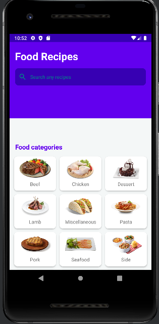
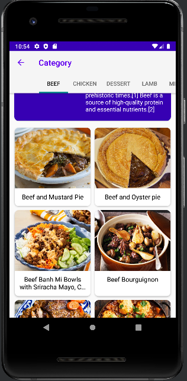
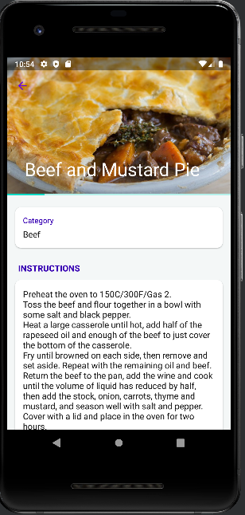

# Food Recipes
## Description
Food recipes is an app that provides recipes for users using mealDB Api to be able to use during their cooking.
## Author
Murielle Iribori
## Demonstration

## Setup instruction
* Clone https://github.com/Irimurielle/Android-Project-2.git
* Use vs code or atom to make changes.
## Technologies Used
* Java
* Markdown
* Android studio
## Contact Information
Email: [irimurielle@gmail.com]
Copyright (c) 2020 [MIT LICENSE]
